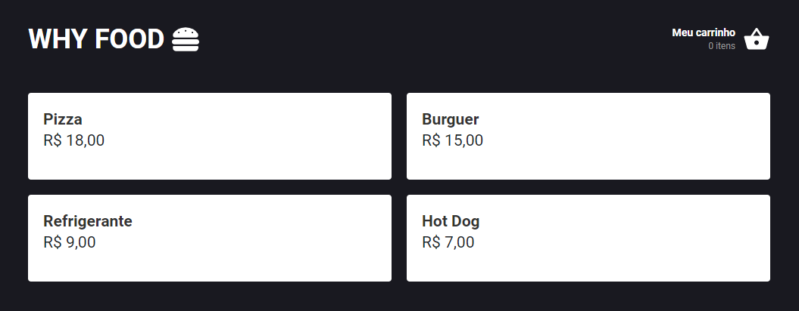
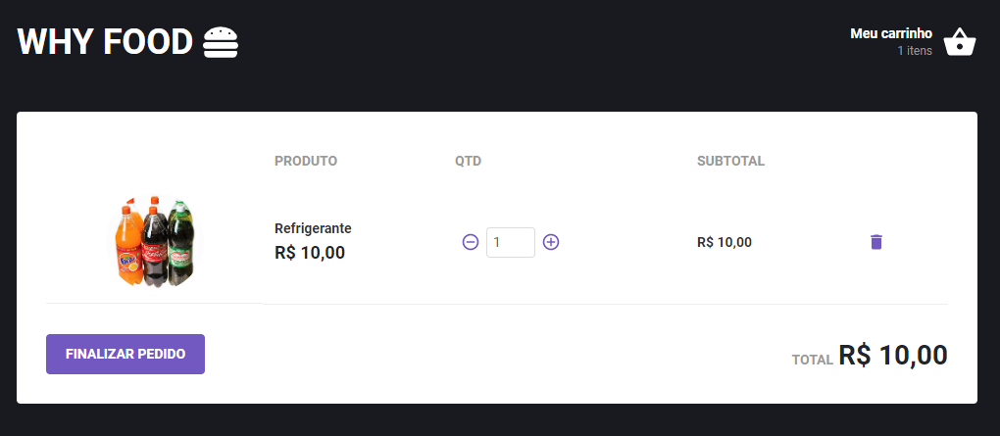

# Why Food

Este projeto é baseado no ifood.

## Validações

Para que o usuário possa adicionar um produto ao carrinho é necessário que seja preenchido todos os campos obrigatórios.

## Instalação

Após copiar o projeto executar o comando `yarn` na raiz do projeto para a instalção de todas as depedencias.

Após finalizar a instalação executar o comando `yarn start` para iniciar o projeto.

# Screenshots

